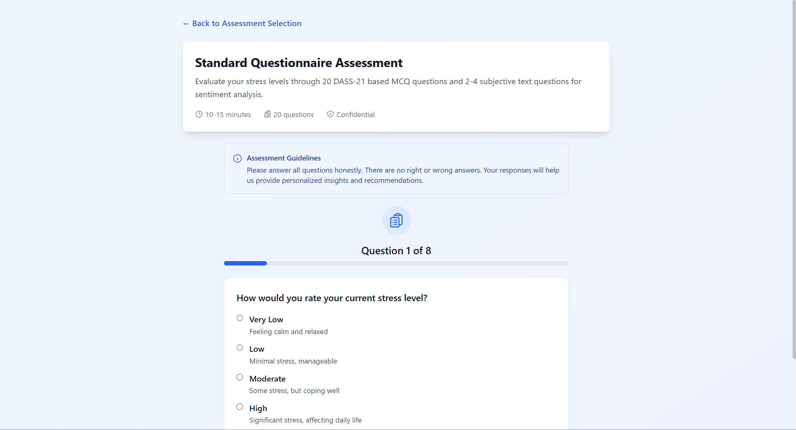
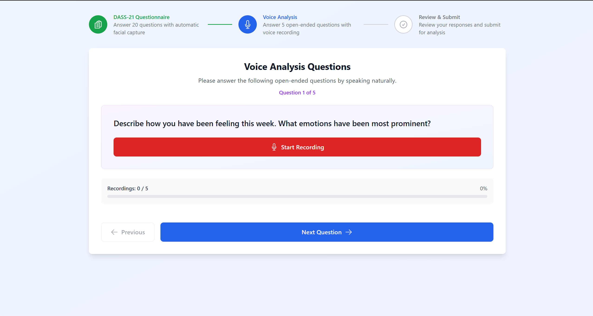
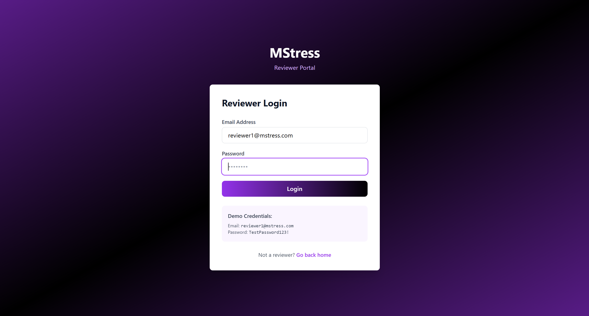
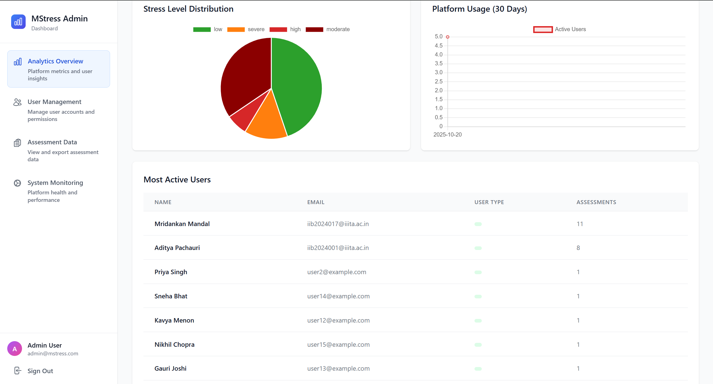

# MStress - Software Requirements Specification (SRS).

## 1. Introduction:

### 1.1 Purpose:

This Software Requirements Specification (SRS) document describes the functional and non-functional requirements for the MStress mental health assessment platform. The document is intended for developers, project managers, and stakeholders to understand the system's capabilities, constraints, and design specifications.

### 1.2 Scope:

MStress is a comprehensive web-based mental health assessment platform that enables users to evaluate their stress, anxiety, and depression levels using the DASS-21 (Depression Anxiety Stress Scale) methodology. The platform integrates AI-powered analysis including facial emotion recognition, voice analysis, and sentiment analysis to provide accurate mental health evaluations. The system supports three user roles: regular users, human reviewers, and administrators.

### 1.3 Definitions, Acronyms, and Abbreviations:

- **DASS-21**: Depression Anxiety Stress Scale with 21 questions.
- **JWT**: JSON Web Token for authentication.
- **REST API**: Representational State Transfer Application Programming Interface.
- **CORS**: Cross-Origin Resource Sharing.
- **RoBERTa**: Robustly Optimized BERT Pretraining Approach for NLP.
- **LSTM**: Long Short-Term Memory neural network.
- **CNN**: Convolutional Neural Network.
- **GPU**: Graphics Processing Unit.
- **VRAM**: Video Random Access Memory.

### 1.4 References:

- DASS-21 Assessment Scale Documentation.
- React 18 Documentation.
- Express.js Documentation.
- MongoDB Documentation.
- FastAPI Documentation.

### 1.5 Document Overview:

This SRS document is organized into the following sections: Introduction, Overall Description, Functional Requirements, Non-Functional Requirements, System Architecture, External Interface Requirements, Data Requirements, and Appendices.

---

## 2. Overall Description:

### 2.1 Product Perspective:

MStress is a standalone web-based mental health assessment platform designed to help individuals evaluate their mental health status. The platform operates as a three-tier microservices architecture consisting of a React frontend, Node.js/Express backend, and Python FastAPI AI services. The system integrates with external services including Google Maps API for location-based resources and Google Gemini API for AI-powered recommendations.

### 2.2 Product Functions:

The MStress platform provides the following core functions:

1. **User Authentication and Authorization**: Secure registration, login, password reset, and role-based access control.
2. **Assessment Management**: Creation, completion, and storage of mental health assessments.
3. **AI-Powered Analysis**: Sentiment analysis, facial emotion recognition, and voice analysis.
4. **Results and Recommendations**: Generation of assessment results and personalized recommendations.
5. **Reviewer Panel**: Human reviewers can review assessments and provide feedback.
6. **Admin Dashboard**: Administrative features for system management and analytics.
7. **Data Export**: Export assessment data in various formats.

The platform provides secure user registration with comprehensive password strength requirements and role-based account creation.

The authentication system provides secure login with email and password credentials for all user types.

### 2.3 User Characteristics:

- **Regular Users**: Individuals seeking mental health assessments. Technical proficiency: basic to intermediate.
- **Human Reviewers**: Mental health professionals reviewing assessments. Technical proficiency: intermediate.
- **Administrators**: System administrators managing the platform. Technical proficiency: advanced.

### 2.4 Constraints:

- **Technical**: The system requires modern web browsers (Chrome, Firefox, Safari, Edge).
- **Regulatory**: The system must comply with data privacy regulations (GDPR, HIPAA).
- **Operational**: The system must maintain 99.5% uptime.
- **Performance**: Response times must be under 2 seconds for 95% of requests.

### 2.5 Assumptions and Dependencies:

- Users have access to a modern web browser.
- MongoDB is available and accessible.
- External APIs (Google Maps, Gemini) are operational.
- Users have stable internet connectivity.

---

## 3. Functional Requirements:

### 3.1 User Authentication and Authorization

- **FR-1.1**: Users can register with email, name, and password.
- **FR-1.2**: Passwords must meet strength requirements (8+ characters, uppercase, lowercase, numbers, special characters).
- **FR-1.3**: Users can log in with email and password.
- **FR-1.4**: Users can reset forgotten passwords via email token.
- **FR-1.5**: JWT tokens expire after 7 days.
- **FR-1.6**: Role-based access control enforces permissions (user, human_reviewer, admin).
- **FR-1.7**: Google OAuth integration for alternative login.

### 3.2 Assessment Functionality

- **FR-2.1**: Users can select from multiple assessment types (standard, advanced, detailed, multi-modal).
- **FR-2.2**: Assessments use DASS-21 scoring methodology.
- **FR-2.3**: Users can save assessment progress and resume later.
- **FR-2.4**: Assessment results include overall score and stress level classification.
- **FR-2.5**: Users can view complete assessment history.
- **FR-2.6**: Assessments can include facial emotion recognition (optional).
- **FR-2.7**: Assessments can include voice analysis (optional).

The assessment selection interface provides users with multiple assessment methodologies to choose from based on their needs and available time.

The questionnaire assessment implements the DASS-21 methodology with intuitive response scales for accurate stress evaluation.

The detailed assessment includes facial emotion recognition capabilities for enhanced assessment accuracy through real-time emotion detection.

The voice analysis assessment captures and analyzes audio data for comprehensive stress evaluation through speech pattern analysis.

### 3.3 AI Services Integration

- **FR-3.1**: Sentiment analysis using RoBERTa model.
- **FR-3.2**: Facial emotion recognition using LibreFace.
- **FR-3.3**: Speech-to-text transcription using OpenAI Whisper.
- **FR-3.4**: Audio feature extraction and analysis.
- **FR-3.5**: AI services provide real-time analysis results.

### 3.4 Reviewer Panel Features

- **FR-4.1**: Reviewers can view pending assessments.
- **FR-4.2**: Reviewers can review assessments and provide feedback.
- **FR-4.3**: Reviewers can assign risk levels (low, moderate, high, critical).
- **FR-4.4**: Reviewers can flag assessments for follow-up.
- **FR-4.5**: Reviewers can view assessment history for users.
- **FR-4.6**: Reviewers can view previous reviews.

The reviewer authentication system provides secure access to the reviewer panel for qualified mental health professionals.

The reviewer dashboard provides access to pending assessments with comprehensive review tools and risk assessment capabilities.

The review interface enables reviewers to provide detailed feedback, assign risk levels, and flag assessments for follow-up action.

### 3.5 Admin Panel Features

- **FR-5.1**: Admins can view all users and their information.
- **FR-5.2**: Admins can view system statistics and analytics.
- **FR-5.3**: Admins can manage user accounts and roles.
- **FR-5.4**: Admins can view all assessments and reviews.
- **FR-5.5**: Admins can export data in CSV format.
- **FR-5.6**: Admins can configure system settings.

The admin authentication system provides secure access to the administrative panel for system administrators.

The admin dashboard provides comprehensive system management capabilities including user administration and analytics.

The user management interface displays all system users with options to view details, modify roles, and manage account status.

The user creation interface allows administrators to register new users and assign appropriate roles within the system.

The admin creation interface enables system administrators to add new administrative users with full system access.

### 3.6 Results and Recommendations

- **FR-6.1**: System generates personalized recommendations based on assessment results.
- **FR-6.2**: Recommendations are powered by Google Gemini API.
- **FR-6.3**: System provides nearby mental health resources using Google Maps API.
- **FR-6.4**: Resources display real-time "Open Now" status.

---

## 4. Non-Functional Requirements:

### 4.1 Performance Requirements

- **NFR-1.1**: Response time for API requests must be under 2 seconds (95th percentile).
- **NFR-1.2**: Frontend page load time must be under 3 seconds.
- **NFR-1.3**: System must support 1000 concurrent users.
- **NFR-1.4**: Database queries must complete within 500ms.

### 4.2 Security Requirements

- **NFR-2.1**: Passwords must be hashed using bcrypt with 10 salt rounds.
- **NFR-2.2**: JWT tokens must be signed with a strong secret key.
- **NFR-2.3**: All sensitive endpoints require authentication.
- **NFR-2.4**: CORS must be configured to allow only specified origins.
- **NFR-2.5**: HTTPS must be used for all communications.
- **NFR-2.6**: Sensitive data must be encrypted at rest.

### 4.3 Reliability and Availability

- **NFR-3.1**: System must maintain 99.5% uptime.
- **NFR-3.2**: Database backups must occur daily.
- **NFR-3.3**: System must recover from failures within 5 minutes.
- **NFR-3.4**: Error handling must be comprehensive and user-friendly.

### 4.4 Scalability

- **NFR-4.1**: System must scale horizontally to handle increased load.
- **NFR-4.2**: Database must support sharding for large datasets.
- **NFR-4.3**: AI services must support load balancing.

### 4.5 Usability and Accessibility

- **NFR-5.1**: UI must be intuitive and user-friendly.
- **NFR-5.2**: System must support WCAG 2.1 accessibility standards.
- **NFR-5.3**: Mobile responsiveness must be supported.
- **NFR-5.4**: System must support multiple languages (future requirement).

### 4.6 Maintainability

- **NFR-6.1**: Code must follow established style guides.
- **NFR-6.2**: Documentation must be comprehensive and up-to-date.
- **NFR-6.3**: System must support easy deployment and updates.

---

## 5. System Architecture:

### 5.1 Three-Tier Microservices Architecture

The MStress platform is built using a three-tier microservices architecture:

1. **Frontend Tier**: React application with Vite build tool.
2. **Backend Tier**: Node.js/Express API server.
3. **AI Services Tier**: Python FastAPI services.
4. **Data Tier**: MongoDB database.

### 5.2 Technology Stack

- **Frontend**: React 18, Vite, Tailwind CSS, Axios.
- **Backend**: Node.js, Express, MongoDB, JWT, bcryptjs.
- **AI Services**: FastAPI, PyTorch, Transformers, Librosa.
- **Database**: MongoDB with Mongoose ODM.

---

## 6. External Interface Requirements:

### 6.1 User Interfaces

- **Web Application**: Responsive web interface accessible via modern browsers.
- **Admin Dashboard**: Specialized interface for system administrators.
- **Reviewer Panel**: Specialized interface for human reviewers.

The user dashboard provides a comprehensive interface for viewing assessment history and stress trends with personalized recommendations.

The admin dashboard provides specialized administrative interface for system management and user administration.

The reviewer panel provides specialized interface for mental health professionals to review assessments and provide clinical feedback.

### 6.2 Hardware Interfaces

- **Camera**: Optional for facial emotion recognition assessments.
- **Microphone**: Optional for voice analysis assessments.

### 6.3 Software Interfaces

- **Google Maps API**: For location-based resource discovery.
- **Google Gemini API**: For AI-powered recommendations.
- **MongoDB**: For data persistence.

### 6.4 Communication Interfaces

- **REST API**: HTTP/HTTPS for all API communications.
- **WebSocket**: For real-time updates (future requirement).

---

## 7. Data Requirements:

### 7.1 Database Collections

- **Users**: User accounts with authentication and profile information.
- **Assessments**: Assessment responses and results.
- **Reviews**: Reviewer feedback and assessments.
- **Questions**: Assessment questions and metadata.

### 7.2 Data Storage and Retention

- **User Data**: Retained indefinitely unless user requests deletion.
- **Assessment Data**: Retained for 7 years for compliance.
- **Logs**: Retained for 90 days.

---

## 8. Appendices:

### 8.1 DASS-21 Scoring Methodology

The DASS-21 scale measures depression, anxiety, and stress on a 0-3 scale for each question. Scores are calculated as follows:

- **Depression**: Sum of questions 3, 5, 10, 13, 16, 17, 21.
- **Anxiety**: Sum of questions 2, 4, 7, 9, 15, 19, 20.
- **Stress**: Sum of questions 1, 6, 8, 11, 12, 14, 18.

Severity classifications:
- **Normal**: 0-9
- **Mild**: 10-13
- **Moderate**: 14-20
- **Severe**: 21-27
- **Extremely Severe**: 28+

### 8.2 Glossary of Terms

- **Assessment**: A mental health evaluation completed by a user.
- **Review**: Feedback provided by a human reviewer on an assessment.
- **Stress Level**: Classification of stress severity (normal, mild, moderate, severe, extremely severe).
- **JWT Token**: Authentication token used for API requests.
- **Role**: User classification (user, human_reviewer, admin).

