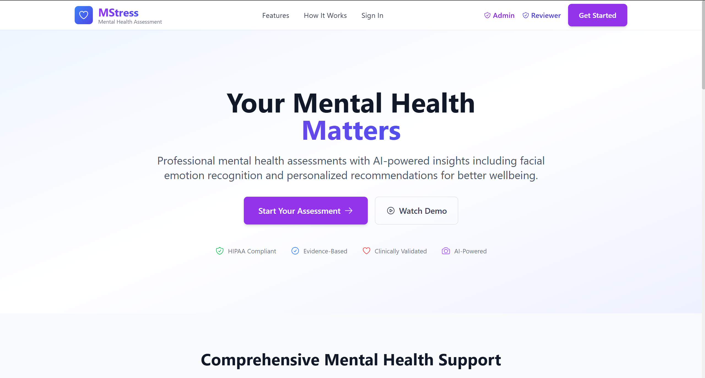
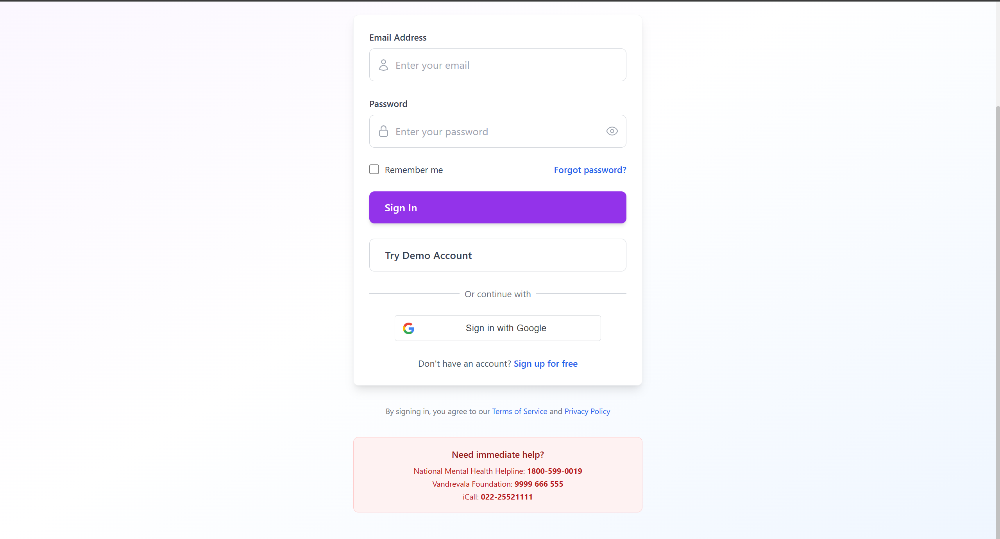

# MStress: Mental Health Assessment Platform.

## Overview:

MStress is a comprehensive mental health assessment platform designed to help users evaluate their stress levels and receive personalized recommendations. The application combines multiple assessment methodologies including questionnaires, facial emotion recognition, voice analysis, and sentiment analysis to provide accurate stress evaluations.



The platform provides an intuitive interface for users to access mental health assessments and resources with a focus on user experience and accessibility.

## Features:

### Core Assessment Types:

1. **Standard Questionnaire Assessment**: DASS-21 based questionnaire with sentiment analysis (10-15 minutes).
2. **Advanced Stress Assessment**: Enhanced questionnaire with advanced sentiment analysis (12-18 minutes).
3. **Detailed Stress Analysis**: Comprehensive assessment with facial emotion recognition (15-20 minutes).
4. **Multi-Modal Stress Assessment**: Complete assessment combining questionnaires, facial recognition, and voice analysis (20-30 minutes).
5. **Anxiety Screening Tool**: Focused anxiety assessment (8-12 minutes).
6. **General Wellbeing Check**: Quick wellbeing evaluation (5-10 minutes).


The platform offers diverse assessment methodologies to accommodate different user needs and time constraints for comprehensive mental health evaluation.

### Key Features:

- **User Authentication**: Secure registration and login with JWT tokens.
- **Password Management**: Forgot password and password reset functionality.
- **Profile Management**: Users can update their profile information and change passwords.
- **Assessment History**: Complete history of all assessments with scores and stress levels.
- **Personalized Recommendations**: AI-generated recommendations based on assessment results using Gemini API.
- **Nearby Resources**: Location-based mental health resources using Google Maps API.
- **Reviewer Panel**: Human reviewers can review assessments and provide feedback.
- **Admin Dashboard**: Administrative features for system management.
- **Real-time Status**: Real-time "Open Now" status for mental health resources.


The dashboard provides comprehensive tracking of assessment history with visual stress trends and AI-generated personalized recommendations for mental health management.

## Technology Stack:

### Frontend:
- **React**: UI framework with React Router for navigation.
- **Vite**: Fast build tool and development server.
- **Tailwind CSS**: Utility-first CSS framework for styling.
- **Heroicons**: Icon library for UI components.
- **Axios**: HTTP client for API requests.
- **React Hot Toast**: Toast notifications for user feedback.

### Backend:
- **Node.js**: JavaScript runtime.
- **Express**: Web framework for API development.
- **MongoDB**: NoSQL database for data storage.
- **JWT**: JSON Web Tokens for authentication.
- **Bcrypt**: Password hashing and verification.
- **Gemini API**: AI-powered recommendations.
- **Google Maps API**: Location-based resource discovery.

### AI Services:
- **FastAPI**: Python web framework for AI services.
- **Transformers**: NLP models for sentiment analysis (RoBERTa).
- **Librosa**: Audio analysis library.
- **OpenAI Whisper**: Speech-to-text transcription.
- **LibreFace**: Facial emotion recognition.


The platform integrates advanced AI technologies including facial emotion recognition and voice analysis for comprehensive multi-modal stress assessment.

## Project Structure:

```
MStress/
├── frontend/                 # React frontend application
│   ├── src/
│   │   ├── pages/           # Page components
│   │   ├── components/      # Reusable components
│   │   ├── App.jsx          # Main app component with routing
│   │   └── index.css        # Global styles
│   └── package.json
├── backend/                  # Node.js/Express backend
│   ├── routes/              # API route handlers
│   ├── models/              # MongoDB schemas
│   ├── services/            # Business logic services
│   ├── middleware/          # Express middleware
│   ├── server.js            # Main server file
│   └── package.json
├── ai-services/             # Python FastAPI services
│   ├── main.py              # FastAPI application
│   ├── services/            # AI service implementations
│   └── requirements.txt      # Python dependencies
├── API.md                    # API documentation
├── CodeBaseIndex.md          # Codebase structure documentation
├── InstallationAndSetup.md   # Installation instructions
└── Usage.md                  # Usage guide
```

## Quick Start:

### Prerequisites:

- Node.js (v14 or higher)
- Python (v3.8 or higher)
- MongoDB (running locally or remote connection)
- npm or yarn package manager

### Installation:

1. **Clone the repository**:
   ```bash
   git clone <repository-url>
   cd MStress
   ```

2. **Run the setup script**:
   ```bash
   .\setup.ps1
   ```

   This will install all dependencies for frontend, backend, and AI services.

### Starting the Application:

1. **Start all services**:
   ```bash
   .\start.ps1
   ```

   This will start all three services in parallel:
   - Backend: http://localhost:5000
   - Frontend: http://localhost:5174
   - AI Services: http://localhost:8000

2. **Access the application**:
   - Open your browser and navigate to `http://localhost:5174`

### Test Credentials:

Use these credentials to test the application:

| Email | Password | Role |
|-------|----------|------|
| `iib2024017@iiita.ac.in` | `TestPassword123!` | User |
| `iib2024001@iiita.ac.in` | `TestPassword123!` | User |
| `reviewer@example.com` | `ReviewerPass123!` | Reviewer |
| `admin@example.com` | `AdminPass123!` | Admin |



The secure login interface provides authentication for users, reviewers, and administrators with role-based access control.

## API Documentation:

For detailed API documentation, see [API.md](./API.md).

## User Roles:

### User:
- Take assessments.
- View assessment history and results.
- Receive personalized recommendations.
- View nearby mental health resources.
- Manage profile and password.

### Human Reviewer:
- Review pending assessments.
- View assessment history for users.
- View previous reviews.
- Provide feedback and risk assessments.
- Flag assessments for follow-up.


The reviewer interface enables human professionals to review assessments, provide clinical feedback, and assess risk levels for user follow-up.

### Admin:
- Access all reviewer features.
- Manage user accounts.
- View system statistics.
- Configure system settings.


The admin panel provides comprehensive system management including user administration, analytics, and configuration capabilities.

## Assessment Scoring:

Assessments use the DASS-21 (Depression Anxiety Stress Scale) scoring methodology:

- **0-9**: Normal
- **10-13**: Mild
- **14-20**: Moderate
- **21-27**: Severe
- **28+**: Extremely Severe

## Security:

- Passwords are hashed using bcrypt with 10 salt rounds.
- JWT tokens expire after 7 days.
- Password reset tokens expire after 1 hour.
- All sensitive endpoints require authentication.
- CORS is configured to allow requests from specified origins.

## Troubleshooting:

### Services not starting:
- Ensure MongoDB is running on `mongodb://localhost:27017`.
- Check that ports 5000, 5174, and 8000 are not in use.
- Verify all dependencies are installed correctly.

### API errors:
- Check the browser console for error messages.
- Review backend logs for detailed error information.
- Ensure all environment variables are configured correctly.

### Database issues:
- Verify MongoDB connection string in environment variables.
- Check that the database exists and is accessible.
- Run the seed script to populate test data: `cd backend && npm run seed`.

## License:

This project is licensed under the Creative Commons Attribution-NonCommercial-ShareAlike 4.0 International (CC BY-NC-SA 4.0) License. See the LICENSE file for details.

