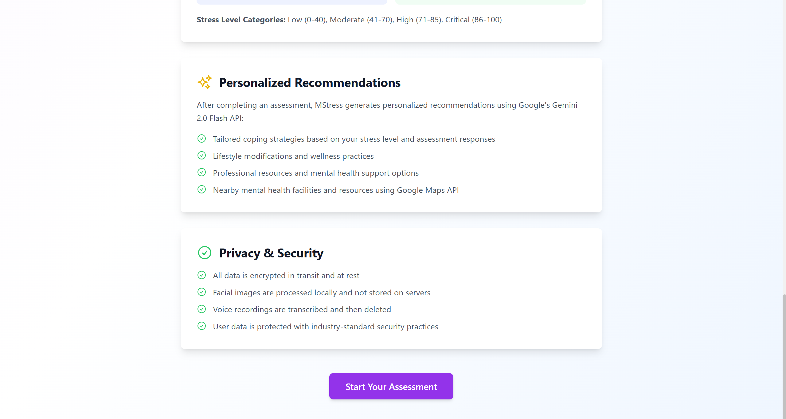
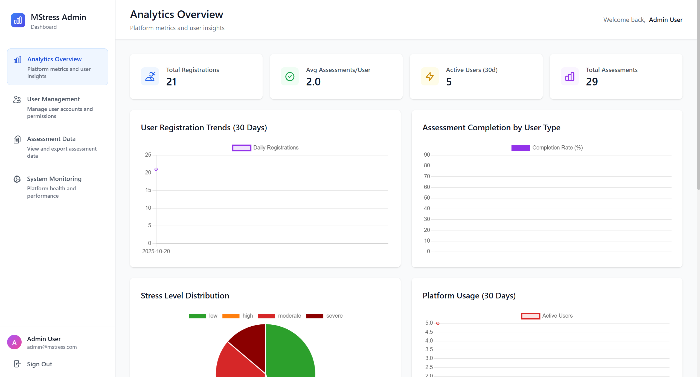

# MStress Usage Guide.

## Starting the Application:

### Quick Start:

To start all three services (Backend, Frontend, and AI Services) with a single command:

```bash
.\start.ps1
```

This PowerShell script will:
1. Start the AI Services (FastAPI) on port 8000.
2. Start the Backend (Node.js/Express) on port 5000.
3. Start the Frontend (Vite) on port 5173.
4. Display the status of each service.

### Manual Start:

If you prefer to start services individually:

**Terminal 1 - AI Services**:
```bash
cd ai-services
python -m uvicorn main:app --host 0.0.0.0 --port 8000 --reload
```

**Terminal 2 - Backend**:
```bash
cd backend
npm start
```

**Terminal 3 - Frontend**:
```bash
cd frontend
npm run dev
```

## Accessing the Application:

Once all services are running, open your browser and navigate to:

```
http://localhost:5173
```

## How It Works:

The MStress platform guides users through a comprehensive mental health assessment process with multiple assessment methodologies and AI-powered analysis.


The platform provides clear guidance on how to use the assessment tools and understand the results.


The system explains the DASS-21 methodology and how different assessment types provide comprehensive mental health evaluation.


The platform describes advanced AI technologies used for enhanced assessment accuracy and real-time emotion analysis.



The results interpretation guide helps users understand their assessment scores and stress level classifications.

## User Registration:

1. Click on the "Register" link on the login page.
2. Enter your email address, name, and password.
3. Password must contain:
   - At least 8 characters.
   - Uppercase letters.
   - Lowercase letters.
   - Numbers.
   - Special characters (@$!%*?&).
4. Click "Register" to create your account.
5. You will be automatically logged in and redirected to the dashboard.


The registration page displays input fields for user credentials and password strength requirements to ensure secure account creation.


The registration form supports multiple user types including regular users and reviewers with role-specific registration options.

## User Login:

1. Enter your email address and password.
2. Click "Login".
3. You will be redirected to the dashboard.


The login interface provides secure authentication with email and password credentials to access the MStress platform.

## Forgot Password:

1. On the login page, click "Forgot password?".
2. Enter your email address.
3. Click "Submit".
4. A password reset token will be generated and you will be redirected to the reset password page.
5. Enter your new password (must meet strength requirements).
6. Confirm your new password.
7. Click "Reset Password".
8. You can now log in with your new password.


The forgot password interface provides a secure way to recover account access by verifying email identity and setting a new password.

## Dashboard:

The dashboard displays:

- **Stress Level Trends**: A chart showing your stress levels over time.
- **Recent Assessments**: A list of your recent assessments with scores and dates.
- **Quick Stats**: Total assessments, current stress level, and trend indicators.
- **Recommendations**: Personalized recommendations based on your latest assessment.


The dashboard provides a comprehensive overview of assessment history, stress trends, and personalized recommendations for mental health management.

### Dashboard Actions:

- **New Assessment**: Click to start a new assessment.
- **Refresh**: Click to refresh dashboard data.
- **Profile Settings**: Click the settings icon to manage your profile.
- **Logout**: Click to log out of your account.

## Taking an Assessment:

### Step 1: Select Assessment Type:

Choose from the available assessment types:

1. **Standard Questionnaire Assessment** (10-15 minutes): DASS-21 based questionnaire.
2. **Advanced Stress Assessment** (12-18 minutes): Enhanced questionnaire with sentiment analysis.
3. **Detailed Stress Analysis** (15-20 minutes): Includes facial emotion recognition.
4. **Multi-Modal Stress Assessment** (20-30 minutes): Combines questionnaires, facial recognition, and voice analysis.
5. **Anxiety Screening Tool** (8-12 minutes): Focused anxiety assessment.
6. **General Wellbeing Check** (5-10 minutes): Quick wellbeing evaluation.


The assessment selection interface allows users to choose from multiple assessment methodologies based on their needs and available time.


The platform provides flexible assessment selection with detailed descriptions of each assessment methodology and expected completion times.


Users can review comprehensive information about each assessment type before selecting the most appropriate option for their needs.


The assessment interface displays visual cues and difficulty indicators to help users select assessments matching their preferences and time availability.

### Step 2: Complete the Assessment:

- Answer all questions honestly.
- For questionnaire-based assessments, select your response on the provided scale.
- For assessments with facial recognition, allow camera access when prompted.
- For assessments with voice analysis, allow microphone access and follow the instructions.


The questionnaire interface presents assessment questions with intuitive response scales for accurate stress and anxiety evaluation.


The assessment form displays progress indicators and allows users to navigate through questions with clear response options for each item.


The facial recognition assessment captures real-time emotion data using the device camera to enhance assessment accuracy.


The voice analysis assessment records and analyzes user speech patterns to provide comprehensive stress evaluation through audio feature extraction.

### Step 3: Review Results:

After completing the assessment, you will see:

- **Overall Score**: Your assessment score (0-100).
- **Stress Level**: Classification (Normal, Mild, Moderate, Severe, Extremely Severe).
- **Detailed Analysis**: Breakdown of your responses and analysis.
- **Recommendations**: Personalized recommendations based on your results.
- **Nearby Resources**: Mental health resources near your location (if location access is granted).


The results page provides comprehensive assessment outcomes including stress classification, detailed analysis, and personalized recommendations for mental health improvement.

## Viewing Assessment History:

1. Go to the Dashboard.
2. Scroll to the "Recent Assessments" section.
3. Click on any assessment to view detailed results.
4. View the assessment score, stress level, and date completed.

## Viewing Recommendations:

1. After completing an assessment, you will be automatically redirected to the Recommendations page.
2. Alternatively, click on "Recommendations" in the dashboard.
3. View personalized recommendations based on your latest assessment.
4. View nearby mental health resources with real-time "Open Now" status.

## Managing Your Profile:

1. Click the settings icon in the dashboard header.
2. Update your name if desired.
3. To change your password:
   - Enter your current password.
   - Enter your new password (must meet strength requirements).
   - Confirm your new password.
4. Click "Save Changes".


The profile settings interface allows users to update personal information and manage password security with validation requirements.


The profile management interface provides comprehensive account settings including password management and personal information updates.

## Reviewer Panel:

### Accessing the Reviewer Panel:

1. Log in with a reviewer account.
2. You will be redirected to the Reviewer Dashboard.


The reviewer login interface provides secure access to the reviewer panel for assessment review and feedback submission.

### Reviewing Assessments:

1. Select an assessment from the "Pending Reviews" list.
2. Review the assessment details and user information.
3. Click "Assessment History" to view all past assessments for this user.
4. Click "Review History" to view all previous reviews for this user.
5. Enter your review:
   - **Review Score**: Rate the assessment (0-100).
   - **Risk Assessment**: Select the risk level (Low, Moderate, High, Critical).
   - **Comments**: Provide detailed feedback.
   - **Flag for Follow-up**: Check if the assessment requires follow-up.
6. Click "Submit Review".


The reviewer dashboard provides access to pending assessments with tools for detailed review, risk assessment, and feedback submission.

## Admin Panel:

### Accessing the Admin Panel:

1. Log in with an admin account.
2. You will have access to all reviewer features plus additional admin features.


The admin login interface provides secure access to the administrative panel with role-based authentication.

### Admin Features:

- View all users and their information.
- View system statistics and analytics.
- Manage user accounts and roles.
- Configure system settings.
- View all assessments and reviews.



The admin dashboard provides comprehensive system management capabilities including user administration, analytics, and configuration options.


The user management interface displays all system users with options to view details, modify roles, and manage account status.


The user creation interface allows administrators to register new users and assign appropriate roles within the system.


The admin creation interface enables system administrators to add new administrative users with full system access.

## Troubleshooting:

### Cannot log in:
- Verify your email and password are correct.
- Check that your account has been created.
- Try resetting your password using the "Forgot password?" link.

### Assessment not submitting:
- Ensure all required fields are filled.
- Check your internet connection.
- Try refreshing the page and starting again.
- Check the browser console for error messages.

### Recommendations not loading:
- Ensure you have completed at least one assessment.
- Check that your location services are enabled (for nearby resources).
- Try refreshing the page.

### Camera or microphone not working:
- Check that your browser has permission to access camera/microphone.
- Ensure no other application is using the camera/microphone.
- Try using a different browser.
- Restart your browser and try again.

## Browser Compatibility:

MStress works best on:
- Chrome (v90+).
- Firefox (v88+).
- Safari (v14+).
- Edge (v90+).

## Performance Tips:

- Use a modern browser for best performance.
- Ensure a stable internet connection.
- Close unnecessary browser tabs to free up memory.
- Clear browser cache if experiencing slow performance.

## Data Privacy:

- Your assessment data is stored securely in our database.
- Your password is hashed and never stored in plain text.
- You can delete your account and all associated data at any time from your profile settings.
- For more information, see our privacy policy.

## Support:

For technical support or questions, please contact the development team.

## Version:

Usage Guide Version: 1.0.0

Last Updated: October 21, 2025.

